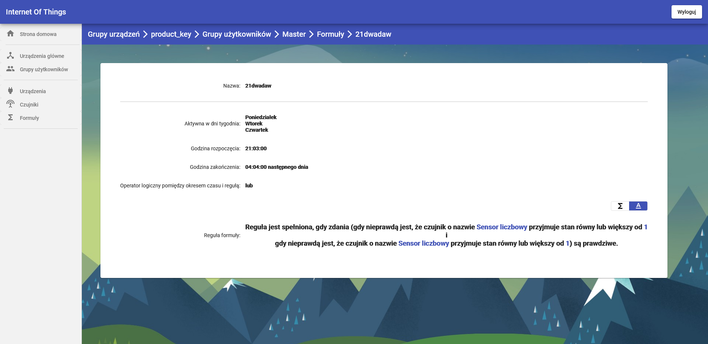

# IoT Web Application
### A web application for managing IoT devices.

The goal of this project is to create a user intarface that allows users to manage their IoT devices.

This project is part of IoT System. Other components in the system:
- RESTful web service - [IoT-RESTful-Webservice](https://github.com/michalkoziara/IoT-RESTful-Webservice)
- A mobile application - [IoT-mobile](https://github.com/michalkoziara/IoT-mobile)

## Getting Started

These instructions will get you a copy of the project up and running on 
your local machine for development and testing purposes.

### Prerequisites

* Node.js [15.5.0 or above] - https://nodejs.org/
* npm [7.3.0 or above] - https://www.npmjs.com/

Detailed information about installation and configurations are provided at developers' site.

## Technology Stack

* Angular [8.2.9+]
* TypeScript
* SCSS
* Chart.js

### Build 

A step by step instruction [on Windows 10]:
* Navigate to project directory in Command Prompt (cmd).
* Run `ng serve` to start application's local development server. 
* Navigate to `http://localhost:4200/` in your browser. 

The application will automatically reload if you change any of the source files.

The continous integration process is managed by Jenkins.

The default provider for the production environment is set to Heroku.

In order to distribute the application in a cloud environment, ``Jenkinsfile`` should be modified accordingly.

## Preview

<table>
    <tr>
        <td>
            
Hub Devices

            
        </td>
        <td>
            
Adding Hub

            
        </td>
    </tr>
    <tr>
        <td>
            
User Groups

            
        </td>
        <td>
            
Devices

            
        </td>
    </tr>
    <tr>
        <td>
            
Sensors

            
        </td>
        <td>
            
Administration Panel

            
Adding Device Type

            
        </td>
    </tr>
    <tr>
        <td>
            
Sensor Statistics

            
        </td>
        <td>
            
Sensor Measurement Chart

            
        </td>
    </tr>
    <tr>
        <td>
            
Creating Automatic Rules

            
        </td>
        <td>
            
Automatic Rule with Boolean Algebra

            
        </td>
    </tr>
    <tr>
        <td>
            
Automatic Rule with Natural Language

            
        </td>
        <td>
            
Device Statistics

            
        </td>
    </tr>
</table>

## Authors

* **Michał Koziara** 
* **Piotr Kramek**
